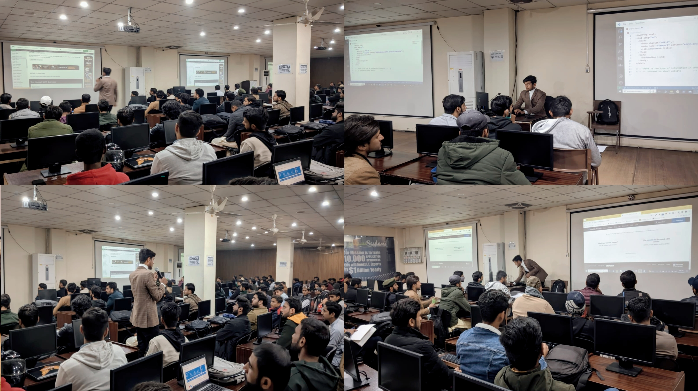

<!-- : [See here!](https://www.linkedin.com/feed/update/urn:li:activity:7190462861754720256/) -->
<!--  # Software Engineer & Tech Trainer 🖥️.  -->
<h1> Software Engineer & Tech Trainer 🖥️. </h1>

<h2><i>Empowering Minds Through Code.</i></h2>
<!-- 

 

  -->

<!-- # Hi there, I'm DANISH MUSTAFA 👋. -->

<!-- ##  -->

<!-- ## Learn with DANISH MUSTAFA :mailbox_with_mail: &nbsp;&nbsp;&nbsp;&nbsp;&nbsp;&nbsp;&nbsp;&nbsp;&nbsp;&nbsp;&nbsp;&nbsp;&nbsp; Wanna see glimpses of how I train? Click below ⬇️ -->
<!-- 

  <b style="display: inline-block; margin-right: 20px; font-size: 2.5em; ">Learn with Ahmad Jajja 📬</b>
  
  
  <b style="display: inline-block;font-size: 1.5em;">Wanna see glimpses of how I train? Click on the picture!</b>

 -->

<!--  -->
<a href="https://drive.google.com/file/d/1VoW3VGwb0dlfR0XMFlPWOvK1b47_CcIK/view" target="_blank" >
<!-- <i style="position: absolute; right : 1;top: 20%; z-index: 3">Saylani Mass IT Training Program</i> -->

</a>	

<!--  -->

           |

- @ **[LeetCode](https://leetcode.com/u/danishmustafa86/)** Solved 200+ Data Structures & Algorithms problems on **[Leetcode](https://leetcode.com/u/danishmustafa86/)**.
-  @[iCodeGuru](https://www.linkedin.com/company/icode-guru/mycompany/) Providing training on Data Structures and Algorithms session
-  @[iCodeGuru](https://www.linkedin.com/company/icode-guru/mycompany/) Providing training on Introduction to Artificial Intelligence 
- If you want to see how I provide training to my students have a look → **[**👀**](https://docs.google.com/spreadsheets/d/1860Cq-mbY6hRbQTr93lJ2_7U9c-qo3A3GOuFupNd1UY/edit?gid=0#gid=0)**
- @ **[Harvard University](https://www.linkedin.com/posts/danishmustafa86_cs50xabrpuzzleabrdayabr2024-activity-7185718867233513472-dUre?utm_source=share&utm_medium=member_desktop)**: Our team got 2nd position by  solving 9/8 complex puzzles.
- **@[iCodeGuru](https://icodeguru.weebly.com/)**: Offers volunteer teaching in AI and DSA, emphasizing LeetCode.
- **@Stanford University**: [Selected](https://www.linkedin.com/posts/danishmustafa86_stanfordabrcodeabrinabrplace-stanford-stanforduniversity-activity-7207801096927375360-O9N1?utm_source=share&utm_medium=member_desktop) Selected as a Senior student.
- **@Harvard University(CS50x_PuzzleDay_Winner)**: Our team [won 2nd place](https://www.linkedin.com/posts/danishmustafa86_cs50xabrpuzzleabrdayabr2024-activity-7185718867233513472-dUre?utm_source=share&utm_medium=member_desktop) at CS50x Puzzle Day 2024 by solving 9/8 complex
puzzles.
- **@[Typing Speed](https://www.linkedin.com/posts/danishmustafa86_assalamualaikum-everyone-guess-what-ive-activity-7211720239103799296-ot6H?utm_source=share&utm_medium=member_desktop)** More than 75wpms.
<!-- - 📫 How to reach me **danishmustafa86@gmail.com** -->

<h2><i>💻 Tech Stack and Tools</i></h2>

<table width="100">
<tr>
    <td align='center' width="190">
        
    </td>
    <td align='center' width="190">
        
    </td>
     <td align='center' width="190">
        
    </td>
     <td align='center' width="190">
        
    </td>
     <td align='center' width="190">
        
    </td>
</tr>
<tr>
    <td align='center'>
        
    </td>
    <td align='center'>
        
    </td>
    <td align='center'>
        
    </td>
    <td align='center'>
        
    </td>
    <td align='center'>
        
    </td>
</tr>
<tr>
    <td align='center'>
        
    </td>
    <td align='center'>
        
    </td>
    <td align='center'>
        
    </td>
    <td align='center'>
        
    </td>
    <td align='center'>
        
    </td>
</tr>
<tr>
    <td align='center'>
        
    </td>
    <td align='center'>
        
    </td>
    <td align='center'>
        
    </td>
    <td align='center'>
        
    </td>
    <td align='center'>
        
    </td>
</tr>
<tr>
    <td align='center'>
        
    </td>
    <td align='center'>
        
    </td>
    <td align='center'>
        
    </td>
    <td align='center'>
        
    </td>
    <td align='center'>
        
    </td>
</tr>

<tr>
    <td align='center'>
        
    </td>
    <td align='center' width="190">
        
    </td>
    <td align='center'>
        
    </td>
    <td align='center'>
        
    </td>
     <td align='center'>
        
    </td>
</tr>

</table>

 
 

## Connect with Me 🤝

  

  <h2><i>⚙️ GitHub Analytics</i></h2>

  

<!-- # Github Contributions
<h4 align="center">Isometric view of contributions in the last year.</h4>

	

 -->

<!-- # Github Metrics

	

 -->
