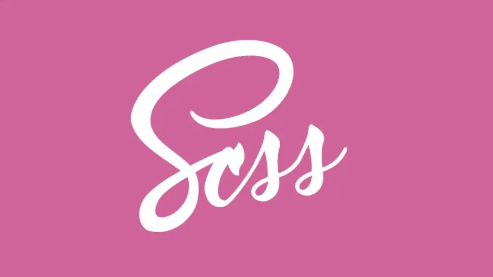
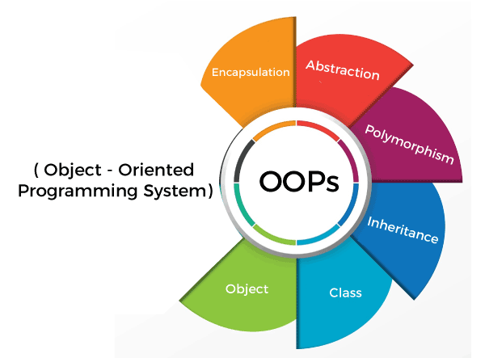

<h1> Software Engineer & Tech Trainer 🖥️ 
  
</h1>
<h2><b>Fueling Passion for Problem-Solving Through Code 🧩</b></h2>

- @ **[LeetCode](https://leetcode.com/u/danishmustafa86/)**: Solved 380+ Data Structures & Algorithms problems on **[Leetcode](https://leetcode.com/u/danishmustafa86/)**.
- @ **[Lablab.ai](https://lablab.ai/u/@danish_mustafa)**: Attended 9 international hackathons via **[Lablab.ai](https://lablab.ai)**.
- @ **[iCodeGuru](https://www.linkedin.com/company/icode-guru/mycompany/)**: Providing training on Data Structures, Algorithms, Python, and Generative AI.  
- **Training Showcase → [👀](https://docs.google.com/spreadsheets/d/1860Cq-mbY6hRbQTr93lJ2_7U9c-qo3A3GOuFupNd1UY/edit?gid=0#gid=0)**  
- @ **[Meta Hacker Cup 2024](https://www.linkedin.com/posts/danishmustafa86_asslam-alaikum-connections-im-happy-to-activity-7244526860087304193-ChXB?utm_source=share&utm_medium=member_desktop)**: Participated and collaborated with international engineers to solve complex problems.  
- @ **[Harvard University](https://www.linkedin.com/posts/danishmustafa86_cs50xabrpuzzleabrdayabr2024-activity-7185718867233513472-dUre?utm_source=share&utm_medium=member_desktop)**: Achieved 2nd position by solving 9/8 complex puzzles in CS50x Puzzle Day 2024.  
- @ **[iCodeGuru](https://icodeguru.weebly.com/)**: Offers volunteer teaching in AI and DSA, emphasizing LeetCode practice.  
- @ **Stanford University**: [Selected](https://www.linkedin.com/posts/danishmustafa86_stanfordabrcodeabrinabrplace-stanford-stanforduniversity-activity-7207801096927375360-O9N1?utm_source=share&utm_medium=member_desktop) as a Senior student.
- **@[Meta Hacker Cup](https://github.com/danishmustafa86/Meta-Hacker-Cup-)**: Participated in Meta Hacker Cup **2024** where my team tackled complex problems and solve them.
- **@[UC Berkeley Coding Competition](https://github.com/danishmustafa86/Advent-Of-Code-2024)**: Participated in UC Berkeley Competition  **2024** where I've work with International Engineers and programmers to solv complex problems.  
- @ **[Typing Speed](https://www.linkedin.com/posts/danishmustafa86_leetcode-icodeguru-ai-activity-7256168302165528577-Vhc2?utm_source=share&utm_medium=member_desktop)**: Achieved more than 92 WPM typing speed.  

<h2><i>💻 Tech Stack and Tools</i></h2>

<table width="100">

<tr>
    <td align='center'>
        
    </td>
    <td align='center' width="190">
        
    </td>
    <td align='center'>
        
    </td>
    <td align='center'>
        
    </td>
     <td align='center'>
        
    </td>
</tr>
 
<tr>
    <td align='center' width="190">
        
    </td>
    <td align='center' width="190">
        
    </td>
     <td align='center' width="190">
        
    </td>
     <td align='center' width="190">
        
    </td>
    <td align='center'>
        
    </td>
</tr>
<tr>
    <td align='center'>
        
    </td>
    <td align='center'>
        
    </td>
    <td align='center'>
        
    </td>
    <td align='center'>
        
    </td>
    <td align='center'>
        
    </td>
</tr>

<tr>
    <td align='center'>
        
    </td>
    <td align='center'>
        
    </td>
    <td align='center'>
        
    </td>
    <td align='center'>
        
    </td>
    <td align='center'>
        
    </td>
</tr>

<tr>
    <td align='center'>
        
    </td>
    <td align='center' width="190">
        
    </td>
    <td align='center'>
        
    </td>
    <td align='center'>
        
    </td>
     <td align='center'>
        
    </td>
</tr>

</table>

 
 

## Connect with Me 🤝

  

<h2><i>⚙️ GitHub Analytics</i></h2>

  

<h2>🏆 COMPLETED INTERNATIONAL HACKATHONS</h2>

  
  
  
  
  
  
  
  

  <strong>Exploring the intersection of technology and creativity as a Software Engineer and Coder. Passionate about solving real-world problems with innovative solutions.</strong>

  

 

 <!-- <table width="100">
<tr>
    <td align='center' width="190">
         
    </td>
     <td align='center' width="190">
        </a> 
    </td>
     <td align='center' width="190">
         
    </td>
     <td align='center' width="190">
       
    </td>
</tr>
<tr>
    <td align='center'>
         
    </td>
    <td align='center'>
        
    </td>
    <td align='center'>
        
    </td>
    <td align='center'>
        
    </td>
</tr>
<tr>
    <td align='center'>
         
    </td>
    <td align='center'>
         
    </td>
    <td align='center'>
	    </td>
    </td>
    <td align='center'>
	
    </td>
</tr>
<tr>
    <td align='center'>
        	
    </td>
    <td align='center'>
        	
    </td>
    <td align='center'>
        	
    </td>
</tr>
</table> -->

